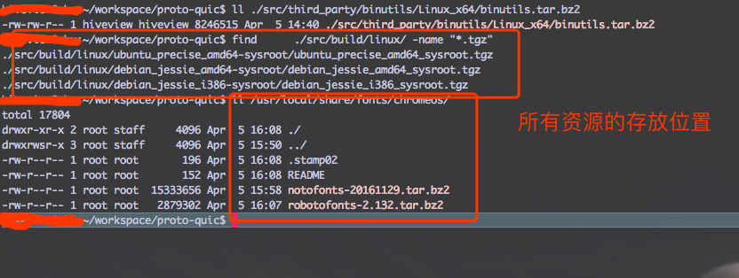

<h2>Table of Contents</h2>

<ul>
<li><a href="#sec-1">1. 官方资源</a>
<ul>
<li><a href="#sec-1-1">1.1. quic 下载地址</a></li>
<li><a href="#sec-1-2">1.2. 官网地址</a></li>
<li><a href="#sec-1-3">1.3. 版本说明</a></li>
</ul>
</li>
<li><a href="#sec-2">2. 手动下载资源记录</a>
<ul>
<li><a href="#sec-2-1">2.1. 修改下载脚本</a></li>
<li><a href="#sec-2-2">2.2. 资源的使用</a></li>
<li><a href="#sec-2-3">2.3. 资源下载地址</a></li>
</ul>
</li>
</ul>

# 官方资源

## quic 下载地址

-   [github 地址](https://github.com/google/proto-quic)

## 官网地址

-   [chromium  官方quic使用说明](https://www.chromium.org/quic/playing-with-quic)

## 版本说明

-   Ubuntu 版本【 14.04, Trusty Tahr 】 （[官方里指定的一个版本](https://chromium.googlesource.com/chromium/src/%2B/master/docs/linux_build_instructions.md)），原来按照github上用的Ubuntu最新版本,结果不成功。爱折腾的可以继续。
-   github  所用版本如下，因为这个项目更新的蛮频繁的，隔了一个周末，内容都不一样了。

    commit 9fa278f82be7949d9f42b7b0fa4bf2391377e944
    Author: Cherie Shi <zhongyi@google.com>
    Date:   Mon Apr 3 16:28:18 2017 -0700
    Updating to 59.0.3062.0 (#44)

# 手动下载资源记录

## 修改下载脚本

-   因为自己的Ubuntu配置VPN后，一执行脚本下载就断网，无奈只能修改脚本手动下载
-   在项目的README.md里，可以看到项目的执行顺序，其中 ./proto\_quic\_tools/sync.sh  里的两个Python文件需要修改。
-   download.py 里下载的包倒是不会删除，会解压在单独的目录中，而install-sysroot.py  脚本会每次删除下载的包。所以修改的思路就是屏蔽到脚本里的下载和删除代码，并将下载的url打印出来。修改后用脚本跑就能看到所需资源得下载地址,
    因为代码中有判断平台的逻辑，所以最好还是用修改后的脚本去执行，从而获取地址。
-   在  ./src/build/install-build-deps.sh  脚本里也会执行一个Python 脚本:./src/build/linux/install-chromeos-fonts.py   这个是用来安装chrome的字体的，修改逻辑同上。
-   以下是本机各个包的存放地址

## 资源的使用

-   编译通过以后就参考[官方的quic 例子](https://www.chromium.org/quic/playing-with-quic)
-   安装官网的操作即可，其中给Ubuntu root用户添加证书的地方需要注意（这个在网上找了很久，自己不会用），在执行完： ./generate-certs.sh 脚本后，其实已经生产了certutil 所需的input 文件  在  net/tools/quic/certs/out/2048-sha256-root.pem 下
    所以给 root添加证书的命令如下 ：

    certutil -d sql:$HOME/.pki/nssdb -A -t "C,," -n "webmail" -i  ./src/net/tools/quic/certs/out/2048-sha256-root.pem

可以执行成功，但是查看的时候总说我的数据库比较老，这个就没再往下深究了（时间紧，谁会的话，还请指点！）
-   这是在网上找到的一个certutil 说明 [certutil 网上说明](http://www.richud.com/wiki/Ubuntu_chrome_browser_import_self_signed_certificate)

## 资源下载地址

-   最后附上下载包地址
-   [百度云盘地址](https://pan.baidu.com/s/1i4AUwjN#list/path%3D%252Fshare)